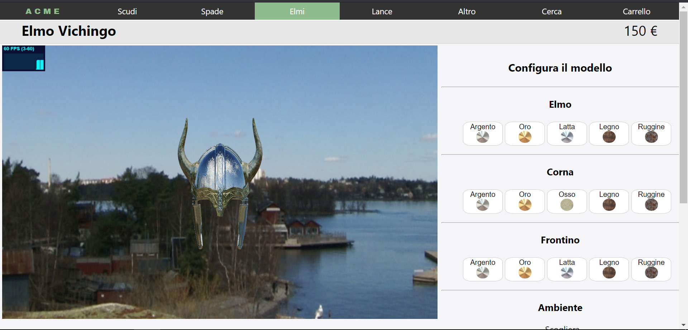
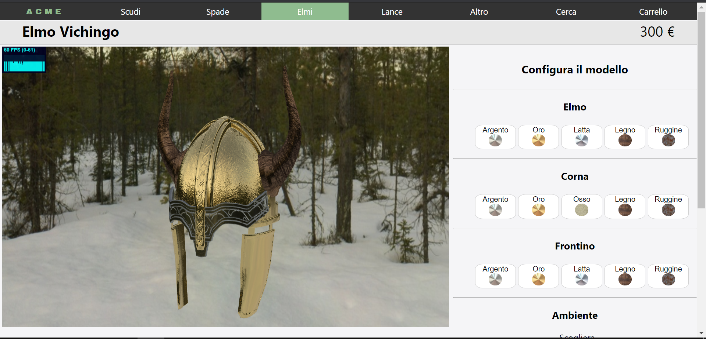
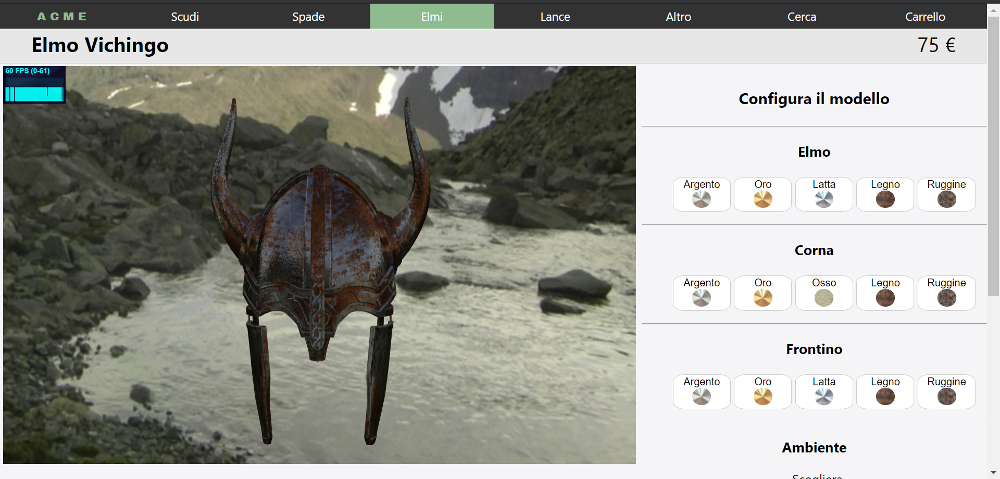
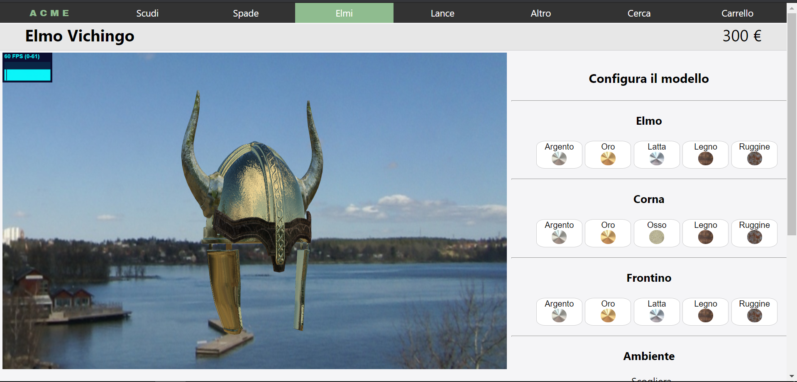
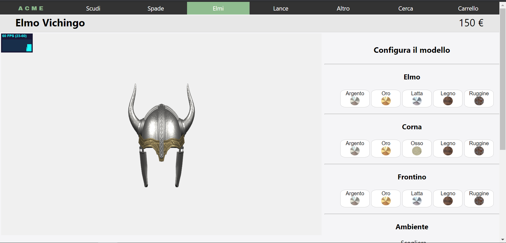

# Corso di Interactive 3D Graphics
# Secondo progetto: Product configuration

## Autori
Valeria Bianco (133886) e Alessandro Gollino (134230)

## Descrizione

Il progetto realizzato è una pagina web stile sito e-commerce che presenta un prodotto in vendita che l'utente può personalizzare ed acquistare. 
Il prodotto sviluppato è la riproduzione di un elmo vichingo: l'utente può modificare i materiali dell'elmo, delle corna e del frontino e vedere il prodotto in diversi ambienti (scogliera, neve, fiordo e nessun ambiente). 
I materiali scelti per l'elmo sono: argento, oro, latta, legno e ruggine. I materiali scelti per le corna sono: argento, oro, osso, legno, ruggine. I materiali scelti per il frontino sono: argento, oro, latta, legno e ruggine.

Il modello scelto si presta bene ad evidenziare molte delle funzionalità viste durante il corso di Interactive 3D graphics.

## Struttura del progetto
- index.html: contiene i tre shader utilizzati e gli elementi dell'interfaccia web;
- css: cartella che contiene il file *.css* per gestire gli elementi dell'interfaccia;
- immagini: la cartella contiene le immagini delle icone utilizzate per i materiali;
- images: la cartella contiene le immagini utilizzate per la creazione del file README.md e journal.md;
- texture: la cartella contiene le texture dei materiali (latta, legno, ruggine, osso), le environment map e le irradiance map degli ambienti della scena;
- model: la cartella contiene il modello 3D utiizzato nel progetto e le texture;
- libs: la cartella contiene le librerie *three.js* utilizzate per il progetto;
- script: cartella contentente il codice *three.js* per la creazione della scena
	- main.js: scena principale importata nella pagina html;
	- funzioni.js: funzioni di supporto;
	- setting.js: variabili e setting generale utilizzate nell'applicazione.

## Risultati
Vengono riportate diverse schermate risultato del sito realizzato

Elmo: argento; Corna: osso; Frontino: oro; Ambiente: scogliera.

Elmo: oro; Corna: legno; Frontino: latta; Ambiente: foresta innevata.

Elmo: ruggine; Corna: ruggine; Frontino: ruggine; Ambiente: fiordo.

Elmo: oro; Corna: osso; Frontino: legno; Ambiente: scogliera.

Elmo: argento; Corna: oro; Frontino: oro; Nessun ambiente: illuminazione tramite tre luci puntiformi.

## Implementazione
Come si può notare il layaout da noi sviluppato e quello della pagina di ispirazione sono molto diversi: abbiamo voluto utilizzare modificandole alcune delle soluzioni adottate nel sito della Apple. 

Per realizzare il configuratore del modello abbiamo utilizzato tre coppie di vertex-fragment shaders:

* *Glossy Reflection Mapping*: per realizzare gli shader dei materiali argento e oro. L'illuminazione proviene dall'ambiente circostante.
* *Irradiance Map with diffuse BRDF*: per realizzare gli shader dei materiali latta, legno, osso, ruggine.
* *Normal mapping*: per realizzare lo shader quando vi è un'illuminazione proveniente da 3 luci puntiformi (settato per funzionare solo con oro e argento)

Gli shader realizzati sono stati presi dal repository del corso di Interactive 3D graphics.

## Credits
- Modello Elmo Vichingo: https://sketchfab.com/3d-models/viking-helmet-3a331e50283644a6b496606a09285105;
- Cubemap: http://www.humus.name;
- Texture materiali: https://ambientcg.com/categories;
- Layaout di ispirazione per la pagina web: https://www.apple.com/it/shop/buy-iphone/iphone-12;
ù
