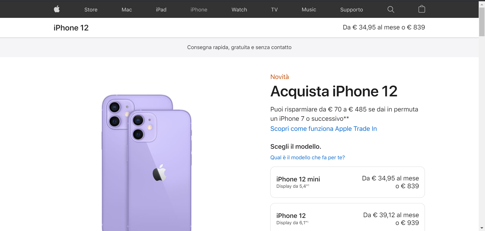
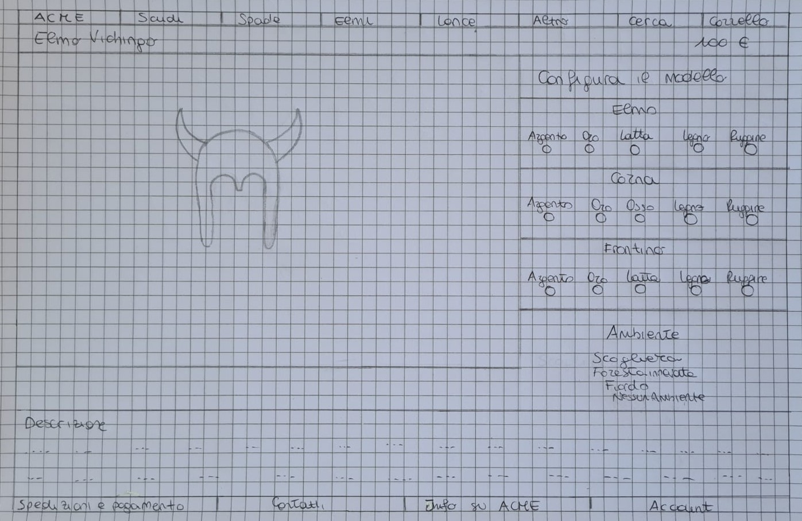

# Journal di Valeria Bianco e Alessandro Gollino

## 1 agosto 2021
* scelta del modello da SketchFab
* caricamento del modello in una semplice scena
* organizzazione struttura file del progetto

## 2 agosto 2021
* sperimentato alcuni shader visti durante il corso sul modello

## 4 agosto 2021
* scelto gli shader da applicare al modello: glossy + env map; irradiance map per le texture; normal map senza cubmap nell'ambiente

## 5 agosto 2021
* Cercato le texture per i materiali scelti per il modello e provate con gli shader

## 6 agosto 2021
* implementazione dello shader glossy per i materiali oro e argento
* cercato di manipolare le 3 parti del modello: elmo, frontino e corna. Abbiamo un problema. Per ora decidiamo di manipolare solo 2 parti
* implementazione dello shader irradiance map per le texture

## 9 agosto 2021
* implementazione shader normal map con aggiunta di 3 luci puntiformi

## 10 agosto 2021
* scelta delle environment map
* generazione delle irradiance map tramite il software photoshop
* semplice interfaccia per controllare i vari materiali
* pulizia codice

## 13 agosto 2021
* pensato all'interfaccia del sito. Il sito che ci ha ispirati è stato quello della apple
* Sito ispirazione:

* Sito progettato:

* personalizzazione dell'interfaccia su carta secondo i nostri gusti

## 14 agosto 2021
* implementazione dell'interfaccia
* pulizia codice

## 28 ottobre 2021
* risolto problema del frontino. Ora si riescono a manipolare tutte le parti
